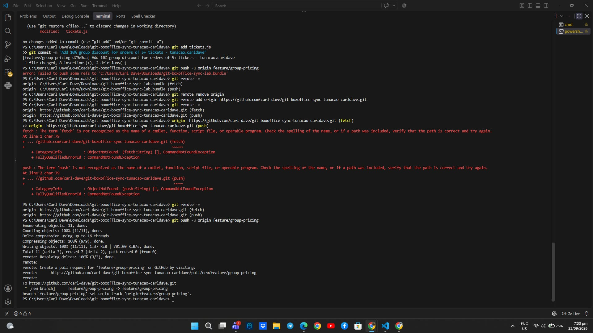
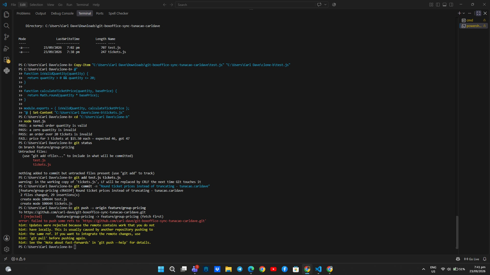
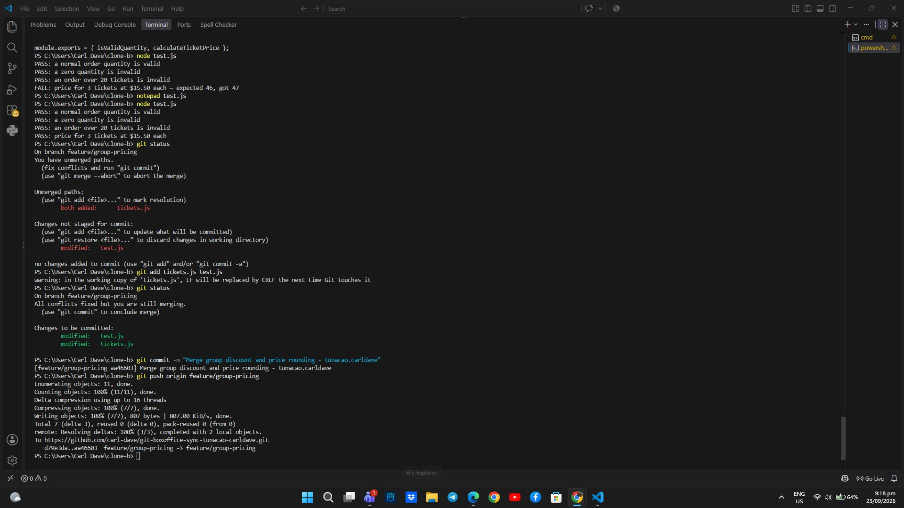
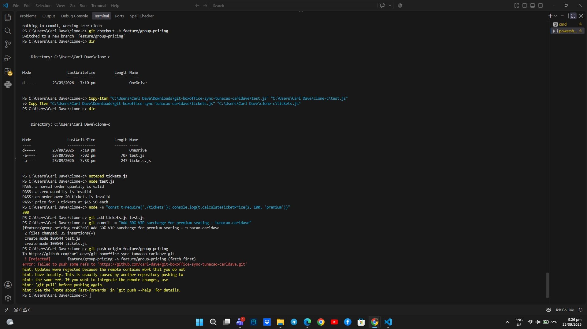
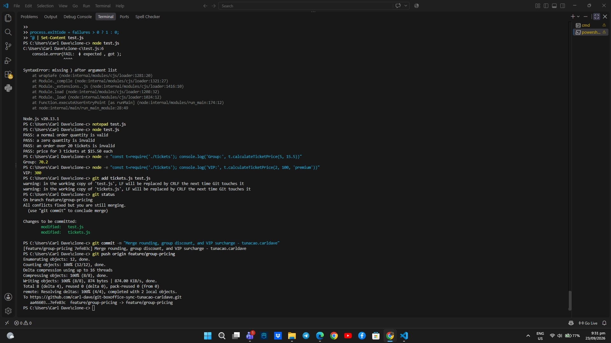
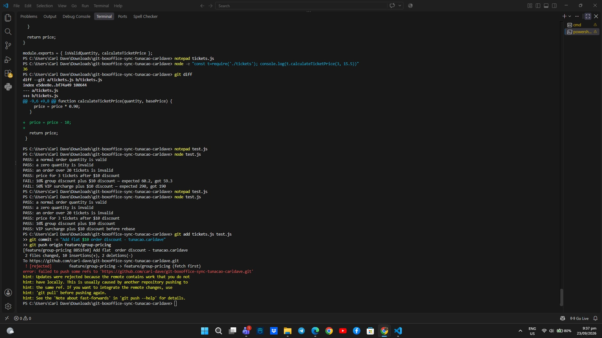
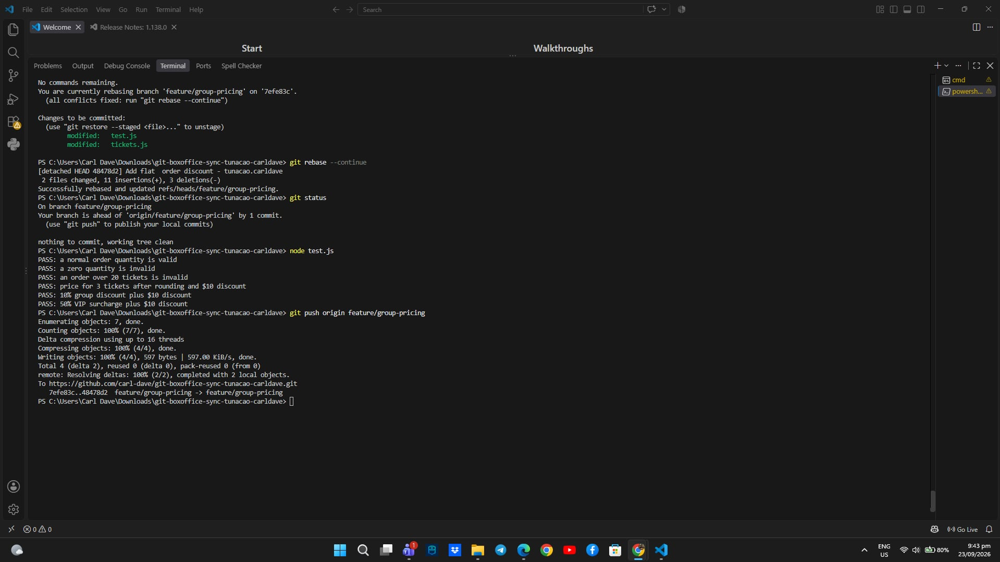
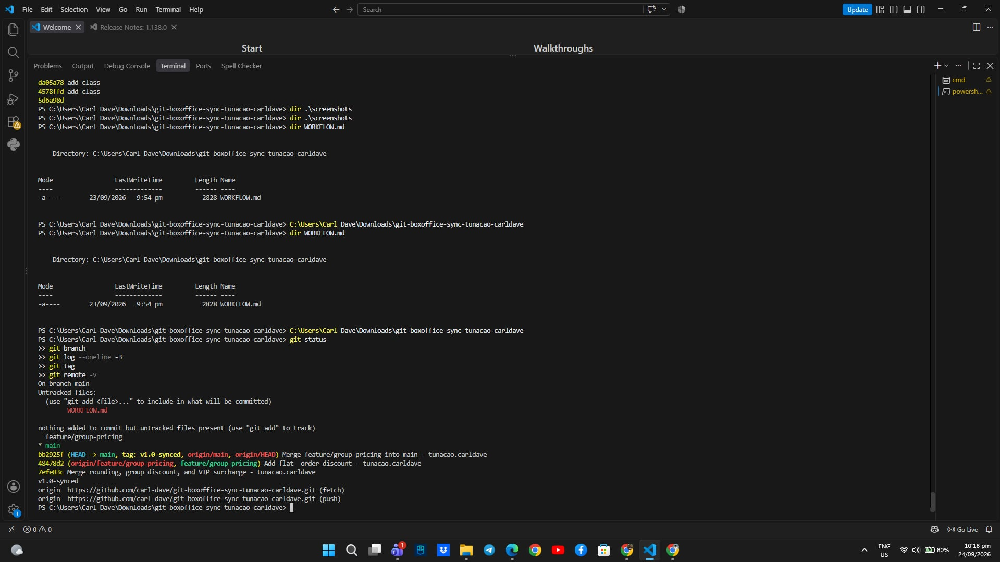

# Box Office Sync Workflow

## 1. Final `calculateTicketPrice`

The final `calculateTicketPrice` combines all four contributors' changes.

* **Clone B:** Changed price calculation from `Math.floor()` to `Math.round()`.
* **Clone A, Task 1:** Added a 10% discount for orders of 5 or more tickets.
* **Clone C:** Added a 50% surcharge when the seating is `"premium"`.
* **Clone A, Task 6:** Added a flat $10 discount to every order.

The final order of operations is:

1. Round the base ticket total.
2. Apply the 10% group discount when the quantity is 5 or more.
3. Apply the 50% VIP surcharge for premium seating.
4. Subtract the flat $10 discount.

The order matters because each operation changes the value used by the next operation.

## 2. Task 3 vs. Task 5 Conflicts

Task 3 was a two-way conflict between the group-pricing change from Clone A and the rounding change from Clone B. The solution was to preserve both behaviors in the same `calculateTicketPrice` function and update the expected test result for the rounded price.

Task 5 was more difficult because it involved three sets of changes: the group discount, price rounding, and the VIP surcharge. The conflict also involved `test.js`, so the tests had to be reconciled along with the implementation. The final version needed all three behaviors to work together.

## 3. Effect of the Flat $10 Discount

The flat $10 discount changed the expected results of the group-pricing and VIP tests because `calculateTicketPrice` is shared by all of those calculations.

For example, the group price that was previously `70.2` became `60.2`, while the VIP price that was previously `300` became `290`.

This shows that changes to shared code are not completely isolated. A change in a common function can affect other features and their tests, even when those features were developed separately.

## 4. Process Change

A useful team process change would be to require developers to fetch and rebase the latest shared branch before pushing their work.

For example:

```text
git fetch origin
git rebase origin/feature/group-pricing
```

This would help developers detect and resolve conflicts locally before attempting to push an outdated branch.

## 5. Screenshot Evidence

### Task 1



### Task 2



### Task 3



### Task 4



### Task 5



### Task 6





### Task 7


